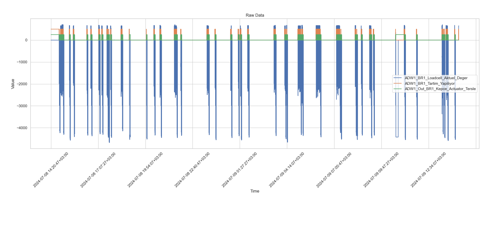
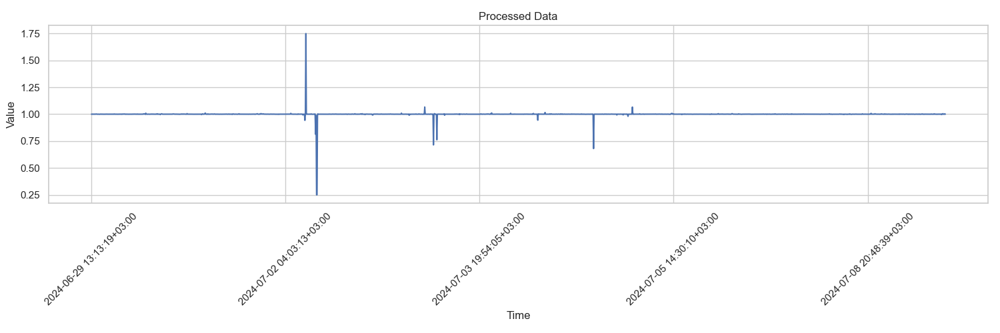

# **TO RUN THE PROJECT**
Currently, only data extraction and preprocessing is complete, in order to run them:
* In order to run this project, a bash file named `pipeline.sh` is created.
* Bash script has different components in them, they are as follows:
  * `PYTHON_INTERPRETER`: Path to local python interpreter, unless configured, script won't work
  * `QUERY_TIME_OFFSET`: time offset between now and a previous date. e.g. 1d => Will extract data of lasyt 24 hours.
  * `RAW_DATA`: csv file that will contain raw extracted data.
  * `PROCESSED_DATA`: csv file that will contain prepared data to feed to the LSTM(?) autoencoder model.

* Please note, unless a WSL is installed, this code won't work in a windows machine.
* Requirements: pandas, influxdb, dotenv, matplotlib, seaborn

Currently, there are also two analysis scripts. `analyze_raw_data.py` and `analyze_preprocessed_data.py`. They are used to analyze the raw and preprocessed data respectively. They are not necessary to run the project, but they are useful to understand the data.
Here are some samples of the analysis:
\
Raw data analysis:
  

Figure 1. Raw data analysis of last 24 hours.

Preprocessed data analysis:
  

Figure 2. Processed data visualization of past 7 days.

